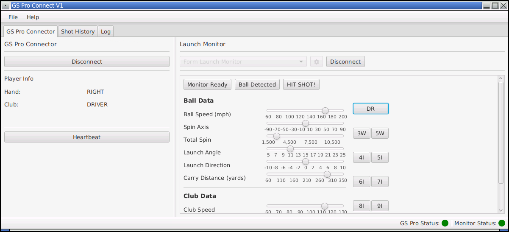
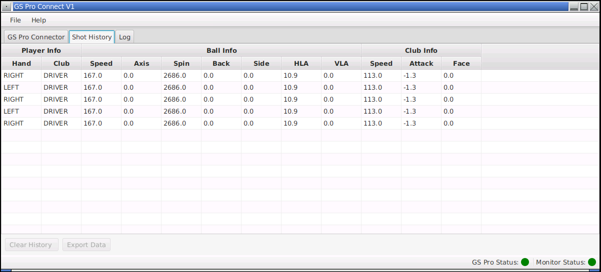
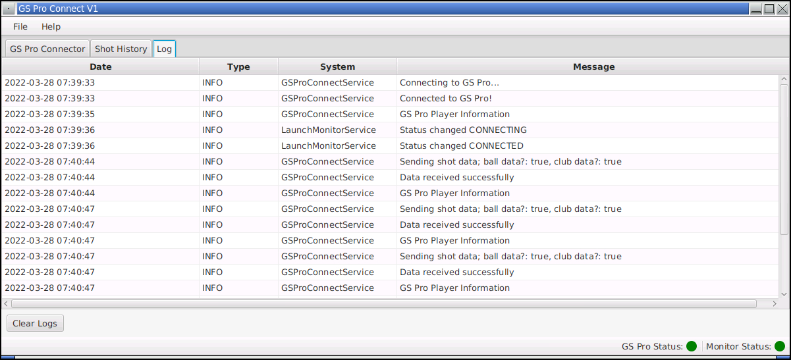

# GS Pro Bridge

Java implementation for communication between launch monitor(s) and the GS Pro software.

> At this point this is just a playground for JavaFX and Spring, playing around with the idea of getting my Tittle X Play working with GS Pro so I can give it a go.

## GS Pro Api

Api is defined at [GSPro Open Connect V1](https://gsprogolf.com/GSProConnectV1.html).  The client provides interfaces and classes to be used within:

- Connector Api Data
- Launch Monitor (Provider)

## GS Pro Client

Client used to connect to and communicate with the [GSPro Open Connect V1](https://gsprogolf.com/GSProConnectV1.html).

> DEPRECATED

At this point the client is just an added layer which isn't needed.  I've left it in there (deprecated) incase it ends up getting used by something else.  But the same functionality has been implemented in the `gspro-app` project using FX properties to allow for status updates.

## GS Pro App

Java FX application (spring boot backed) providing the interface for the GS Pro and Launch Monitor management.  The application is pretty straight forward:

### GS Pro / Launch Monitor

Select one of the launch monitors you have installed and click the **Connect** button.  Things should be relatively smooth after that point.

- [ ] Implement the heartbeat thread to continually check on GS Pro
- [ ] Start adding a couple sample launch monitors
- [ ] Implement the Launch Monitor Properties screen

### Shot History

Provides the shot history.

> This is not based on the shot actually being successful (just that it was attempted).  If it was a valid launch monitor shot and just wasn't picked up by GS Pro, you'll still want to be able to access  thtat data.

- [ ] Add export functionality to the Shot History

### Debug Log

Simple two directional logging, incase anything goes down and you need to look at what's up.

- [ ] Add export functionality to debug log

## Contribution

Feel free to throw any suggestions or fixes my way:

1. Fork
2. Branch
3. Develop (VSCode)
4. Pull request

Development is done within a `devcontainer` and hopefully keeps things super easy.   When building the `devcontainer` the post build step will run `mvn install -DskipTests`.  Once this is completed you'll most likely have to restart the Java Lanuage Server.

> Java development and devcontainers seems to be a little finicky.  But once it's up with the Java Language server going, it's pretty slick.

## License

[MIT License](LICENSE.md)
